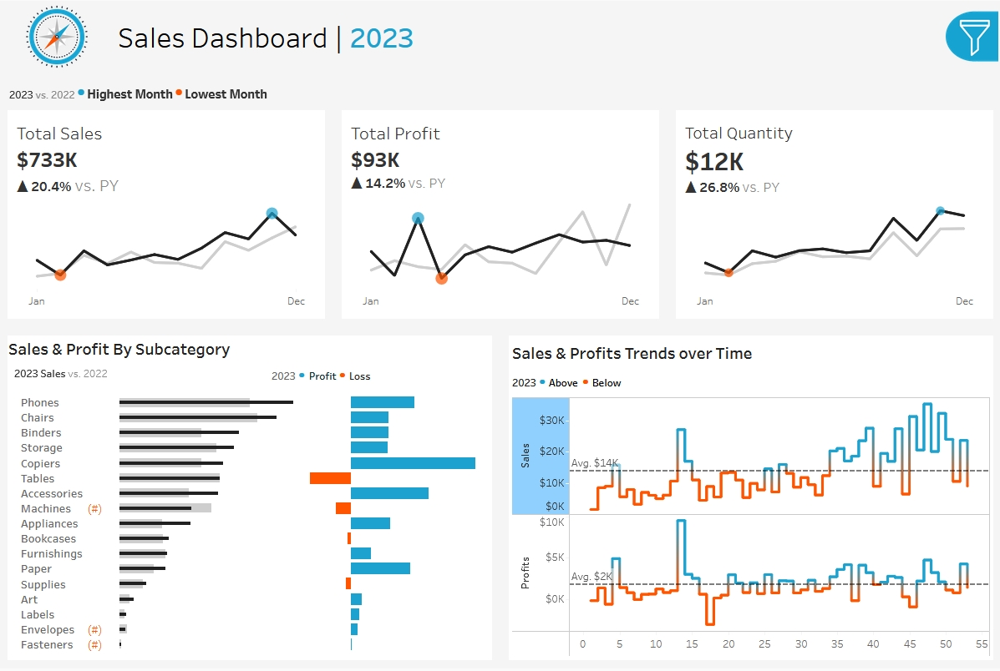

# 📊 Sales Dashboard

An interactive sales analytics dashboard designed to explore performance across time, geography, and product hierarchies. The dashboard enables data-driven decision-making through dynamic filters, KPIs, and visual trends.

---

## 🚀 Overview

This project provides a comprehensive view of sales performance with comparisons between the current year and previous year. Users can slice and drill into data by multiple dimensions to uncover insights at different levels of granularity.

---

## 🔎 Key Features

### 🎛️ Interactive Filters
Users can dynamically filter the dashboard by:
- Year
- Category
- Subcategory
- Region
- State
- City

All visuals and metrics update instantly based on selected filters.

---

### 📌 Key Performance Indicators (KPIs)
- **Total Sales**
- **Total Profit**
- **Total Quantity Sold**
- **Current Year vs Previous Year comparison**

These KPIs provide a quick snapshot of overall business performance.

---

### 📈 Visual Analytics

- **Sales & Profit by Subcategory**  
  Understand which subcategories drive revenue and profitability.

- **Sales & Profit Trends Over Time**  
  Analyze performance patterns, seasonality, and growth trends.

- **Year-over-Year Comparison**  
  Track progress and identify increases or declines compared to the previous year.

---

## 🧠 Use Cases

- Executive performance reporting
- Sales trend analysis
- Regional and category-level insights
- Identifying high-performing and underperforming segments

---

## 🛠️ Tech Stack

- Data Visualization Tool: Tableau
- Data Source: Sales dataset (CSV)

---

Also this project could be seen on Tableau Public [here](https://public.tableau.com/app/profile/andrzej.awr/viz/FirstProject_17105147621340/SalesDashboard)
